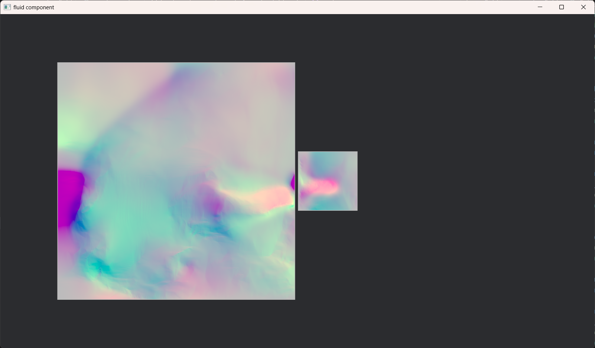
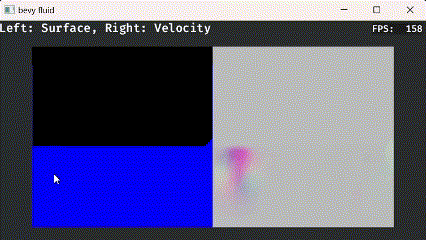

# bevy fluid sample

This project is a fluid simulation sample built using the Bevy engine.

Try it on [here](https://narasan49.github.io/bevy-fluid-sample/)!

## Features
- [x] Incompressible 2D fluid simulation
- [ ] Viscosity
- [ ] Fluid surface
  - [x] Basic implementation
  - [ ] Mass conservation
  - [ ] Fluid source/drain
- [ ] Solid body interaction
  - [x] One-way solid body to fluid interaction
  - [ ] Two-way coupling with solid body and fluid

## Getting Started

To run the Bevy Fluid Sample, you will need to have Rust and Cargo installed on your system. Follow these steps to get up and running:

1. Clone the repository:
```ps1
git clone git@github.com:narasan49/bevy-fluid-sample.git
```

2. Navigate to the project directory:

```ps1
cd bevy-fluid-sample
```

3. Build and run the project:
I have some examples to demonstrate my fluid simulation:
    - **Imposing forces with mouse and touch input**
      (Also available [here](https://narasan49.github.io/bevy-fluid-sample/))
      ```ps1
      cargo run --example interaction
      ```
      https://github.com/user-attachments/assets/bcb7839d-115b-4bc9-ba78-68c4d1cdc7a2
      
    - **Solid-to-fluid feedback**

      ```ps1
      cargo run --example demo
      ```
      https://github.com/user-attachments/assets/af3e9aa5-b768-4375-ba44-a4876557524c

    - **Spawn multiple fluids**
      ```ps1
      cargo run --example multiple
      ```
      

    - **Fluid surface**
      ```ps1
      cargo run --example water_surface
      ```
      

## Acknowledgments
The simulation is inspired by and based on the algorithms described in these books:

- [Fluid Simulation for Computer Graphics](https://www.amazon.co.jp/dp/1482232839) by Robert Bridson
- [GPU Gems Chapter 38](https://developer.nvidia.com/gpugems/gpugems/part-vi-beyond-triangles/chapter-38-fast-fluid-dynamics-simulation-gpu) by Mark J. Harris

I alse use [Kenny](https://kenney.nl/) assets for examples.
