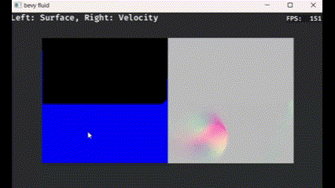
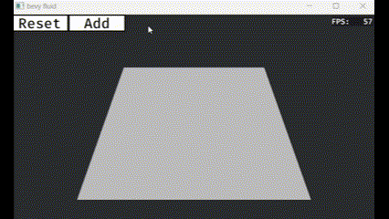

# bevy_eulerian_fluid

This project is a fluid simulation plugin for [Bevy](https://bevyengine.org/).



Try it on [here](https://narasan49.github.io/bevy-fluid-sample/)!

## Basic Usage
1. Add `FluidPlugin` to the app.
2. Spawn `FluidSettings`, then `FluidSimulationBundle` will be inserted automatically to the entity. By querying components bundled with `FluidSimulationBundle` such as `VelocityTextures`, the simulation results can be retreived. (See [examples](./examples/) for the detailed implementation!)

```rust
use bevy_eulerian_fluid::{
    definition::{FluidSettings, LevelsetTextures, VelocityTextures},
    FluidPlugin,
};

fn main() {
    App::new()
        .add_plugins(DefaultPlugins)
        .add_plugins(FluidPlugin)
        .add_systems(Startup, setup_scene)
        .add_systems(Update, on_initialized)
        .run();
}

fn setup_scene(mut commands: Commands) {
    commands.spawn(Camera2dBundle::default());

    commands.spawn(FluidSettings {
        dx: 1.0f32,
        dt: 0.5f32,
        rho: 997f32, // water
        gravity: Vec2::Y,
        size: SIZE,
        initial_fluid_level: 0.9,
    });
}

fn on_initialized(
    mut commands: Commands,
    query: Query<(Entity, &LevelsetTextures, &VelocityTextures), Added<LevelsetTextures>>,
    mut meshes: ResMut<Assets<Mesh>>,
    mut materials: ResMut<Assets<CustomMaterial>>,
    mut velocity_materials: ResMut<Assets<VelocityMaterial>>,
) {
    for (entity, levelset_textures, velocity_textures) in &query {
        // Implement your own code to visualize the results.
    }
}
```

### Interact to the fluid
The simulation entity has `LocalForces` component, which holds arrays of forces (in m/s^2) and position (in pixels). forces can be applied to the simulation domain by setting `LocalForces`.

See also an [interaction example](./examples/interaction.rs) for the detailed implementation.

## Features
- [x] Incompressible 2D fluid simulation
- [ ] Viscosity
- [ ] Fluid surface
  - [x] Basic implementation
  - [ ] Fluid source/drain
- [ ] Solid body interaction
  - [x] One-way solid body to fluid interaction
  - [ ] Two-way coupling with solid body and fluid

## Examples
There are some examples to demonstrate how to visualize and interact to the simulation results:  
- **Imposing forces with mouse and touch input**
  (Also available [here](https://narasan49.github.io/bevy-fluid-sample/))
  ```ps1
  cargo run --example interaction
  ```
  

- **Solid-to-fluid feedback**

  ```ps1
  cargo run --example demo
  ```
  

- **Spawn multiple fluids**
  ```ps1
  cargo run --example multiple
  ```
  

- **Fluid surface**
  ```ps1
  cargo run --example water_surface
  ```
  

## Acknowledgments
The simulation is inspired by and based on the algorithms described in these books:

- [Fluid Simulation for Computer Graphics](https://www.amazon.co.jp/dp/1482232839) by Robert Bridson
- [GPU Gems Chapter 38](https://developer.nvidia.com/gpugems/gpugems/part-vi-beyond-triangles/chapter-38-fast-fluid-dynamics-simulation-gpu) by Mark J. Harris

I alse use [Kenny](https://kenney.nl/) assets for examples.

## License

Licensed under either of

 * Apache License, Version 2.0
   ([LICENSE-APACHE](LICENSE-APACHE) or http://www.apache.org/licenses/LICENSE-2.0)
 * MIT license
   ([LICENSE-MIT](LICENSE-MIT) or http://opensource.org/licenses/MIT)

at your option.

## Contribution

Unless you explicitly state otherwise, any contribution intentionally submitted
for inclusion in the work by you, as defined in the Apache-2.0 license, shall be
dual licensed as above, without any additional terms or conditions.
