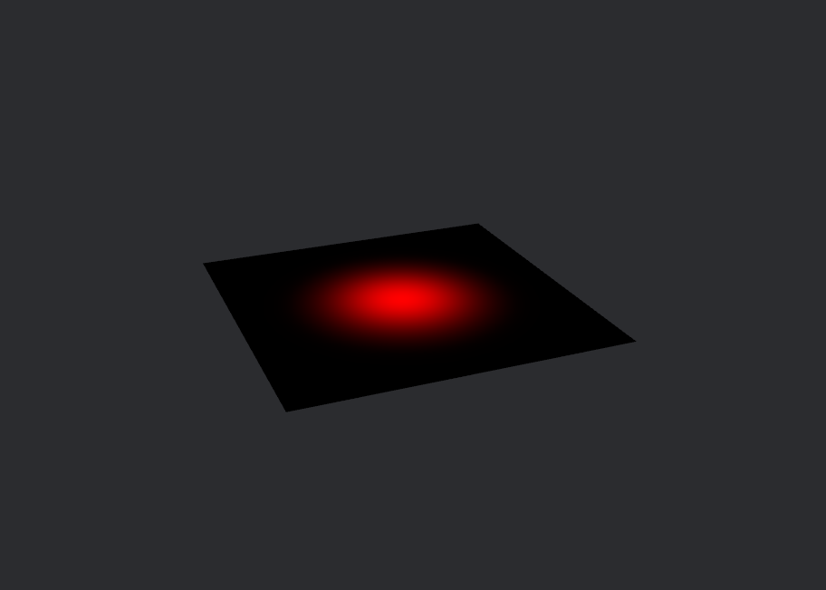

# [Bevy] Compute shaderの計算結果を描画する

Bevy Engineで、Compute Shaderでテクスチャを更新して、その結果を描画する方法を理解するために、
[Game of life example](https://github.com/bevyengine/bevy/blob/release-0.13.2/examples/shader/compute_shader_game_of_life.rs)を読んだ際の記録を残します。  
Bevyエンジンに関する説明はほぼありません。  

## 環境
- Bevy 0.13.2
- Windows 11

## 概要
- Game of life exampleでは、compute shader, SpriteBundleに共通のTextureのハンドル(`Handle<Image>`)を持たせて、compute shaderでテクスチャを更新していました。  
- より一般的に、compute shaderでテクスチャの更新を行い、fragment shaderを介して描画する方法もご紹介します。

## compute shaderの使い方
render worldで`RenderGraph`という機能により利用できますが、詳細は割愛します(私があまり理解できていないので、、)。
shaderの実行には、ComputePassにBindGroupとComputePipelineをセットして実行するというごく普通のシェーダーの流れになります。
```rs
let mut pass = render_context
    .command_encoder()
    .begin_compute_pass(&ComputePassDescriptor::default());

// 中略

pass.set_bind_group(0, texture_bind_group, &[]);
pass.set_pipeline(init_pipeline);
pass.dispatch_workgroups(SIZE.0 / WORKGROUP_SIZE, SIZE.1 / WORKGROUP_SIZE, 1);
```

## bevy リソース
bevyにおいてリソースとは、実行中に一つしか存在しないデータのことですが、GameOfLifeでは以下のようなリソースが用いられています。
- **GameOfLifeImage**: shaderに渡すテクスチャなどのデータ。AsBindGroupマクロにより、シェーダーリソースのレイアウト情報も保持している。
    - compute shader以外からも参照されるため、main worldにリソースを配置します。デフォルトではworldの外のリソースを参照できないため、`ExtractResourcePlugin`を利用して、render worldからも見られるようにします。
- **ComputePipeline**: ComputePipelineやBindGroupLayoutを保持。
    - BindGroupLayout: shaderに渡すデータのフォーマット等を定義するデータ。AsBindGroupから生成可能。
- **GameOfLifeImageBindGroup**: shaderにバインドするシェーダーリソースのレイアウト情報とデータを保持しています。

```rs
// compute shaderに渡すデータ。textureは2D描画のためにSpriteBundleとも共有されます。
#[derive(Resource, Clone, Deref, ExtractResource, AsBindGroup)]
struct GameOfLifeImage {
    #[storage_texture(0, image_format = Rgba8Unorm, access = ReadWrite)]
    texture: Handle<Image>,
}

#[derive(Resource)]
struct GameOfLifeImageBindGroup(BindGroup);

// GameOfLife exampleでは初期化と更新の2つのシェーダーを利用しているため、パイプラインが2つあります。
#[derive(Resource)]
struct GameOfLifePipeline {
    texture_bind_group_layout: BindGroupLayout,
    init_pipeline: CachedComputePipelineId,
    update_pipeline: CachedComputePipelineId,
}

impl FromWorld for GameOfLifePipeline {
    fn from_world(world: &mut World) -> Self {
        // BindGroupLayoutの作成
        // shaderのロード
        // ComputePipelineの作成
    }
}
```
各種bevyリソース

## 描画
サンプルでは、SpriteBundleのtextureにハンドルを割り当てることで、compute shaderの計算結果を描画しています。
```rs
fn setup(mut commands: Commands, mut images: ResMut<Assets<Image>>) {
    let mut image = Image::new_fill(
        Extent3d {
            width: SIZE.0,
            height: SIZE.1,
            depth_or_array_layers: 1,
        },
        TextureDimension::D2,
        &[0, 0, 0, 255],
        TextureFormat::Rgba8Unorm,
        RenderAssetUsages::RENDER_WORLD,
    );
    image.texture_descriptor.usage =
    TextureUsages::COPY_DST | TextureUsages::STORAGE_BINDING | TextureUsages::TEXTURE_BINDING;

    let image: Handle<Image> = images.add(image);

    // compute shaderと共通のテクスチャのハンドルを割り当てる。
    commands.spawn(SpriteBundle {
        sprite: Sprite {
            custom_size: Some(Vec2::new(SIZE.0 as f32, SIZE.1 as f32)),
            ..default()
        },
        texture: image.clone(),
        ..default()
    });

    // compute shaderのリソースとして登録
    commands.insert_resource(GameOfLifeImage { texture: image });
}
```

自作のfragment shaderとcompute shaderでテクスチャを共有することもでき、以下のように記述します。
```rs
#[derive(Asset, Clone, AsBindGroup, TypePath, Debug)]
pub struct CustomMaterial {
    #[uniform(0)]
    pub base_color: Color,
    #[texture(1)]
    #[sampler(2)]
    pub texture: Handle<Image>,
}

impl Material for CustomMaterial {
    fn fragment_shader() -> ShaderRef {
        "shaders/custom_material.wgsl".into()
    }
}
```

```wgsl
@group(0) @binding(0) var texture: texture_storage_2d<rg32float, read_write>;

@compute @workgroup_size(8, 8, 1)
fn init(
    @builtin(global_invocation_id) invocation_id: vec3<u32>,
    @builtin(num_workgroups) num_workgroups: vec3<u32>,
) {
    let location = vec2<i32>(i32(invocation_id.x), i32(invocation_id.y));
    let velocity = vec2<f32>(gausian_2d(256.0 - f32(invocation_id.x), 256.0 - f32(invocation_id.y), 50.0), 0.0);

    textureStore(texture, location, vec4<f32>(velocity, 2.0, 1.0));
}

@compute @workgroup_size(8, 8, 1)
fn update(@builtin(global_invocation_id) invocation_id: vec3<u32>) {

}

fn gausian_2d(x: f32, y: f32, sigma: f32) -> f32 {
    let b = -1.0 / (2.0 * sigma * sigma);
    return exp(b * (x * x + y * y));
}
```
compute shader

```wgsl
#import bevy_pbr::forward_io::VertexOutput;

@group(2) @binding(0) var<uniform> base_color: vec4<f32>;
@group(2) @binding(1) var texture: texture_2d<f32>;
@group(2) @binding(2) var sampler: sampler;

@fragment
fn fragment(
    mesh: VertexOutput,
) -> @location(0) vec4<f32> {
    var v = textureSample(texture, sampler, mesh.uv).rg;
    
    return vec4<f32>(v, 0.0, 1.0);
}
```
fragment shader

以下のような描画結果が得られます。  
